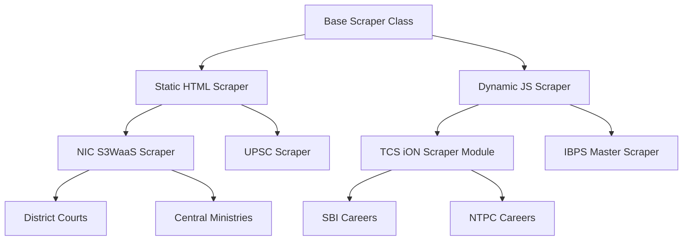

# GovTrack AI: Master Project Blueprint (Phase 0)

This master document serves as the architectural foundation and primary dataset for GovTrack AI. It maps out 155+ government recruitment sources across India, defining shared architectures, scraping dependencies, implementation roadmaps, and optimal folder structures.

## 1. Executive Summary
GovTrack AI is designed as a long-term, highly modular, production-quality Government Recruitment Tracking System. To ensure scalability, the system relies on a plug-and-play architecture where adding a new recruitment organization requires only a new scraper module and configuration entry, leaving the core engine untouched. 

This blueprint meticulously categorizes the Indian government recruitment landscape, highlighting centralized portals, shared software infrastructures, and technical edge cases.

---

## 2. Top 25 High-Priority Organizations (B.Tech Cyber Security Focus)
These organizations offer the highest volume of technical, IT, and Cyber Security roles (Scientist 'B', Cyber Security Analyst, IT Officer, Technical Assistant, Security Researcher). They form Phase 1 of the implementation roadmap.

1. **CERT-In (Indian Computer Emergency Response Team)** - Core cyber defense agency.
2. **NCIIPC (National Critical Information Infrastructure Protection Centre)** - Protects critical infra.
3. **NTRO (National Technical Research Organisation)** - Technical intelligence agency.
4. **Intelligence Bureau (IB)** - ACIO-I/II (Computer Science/IT) recruitment.
5. **C-DAC (Centre for Development of Advanced Computing)** - R&D, project engineers in cyber/IT.
6. **NIC (National Informatics Centre)** - Scientist B, Scientific/Technical Assistants.
7. **NIELIT (National Institute of Electronics and Information Technology)** - IT staff and scientists.
8. **STQC (Standardisation Testing and Quality Certification)** - IT quality assurance and security.
9. **I4C (Indian Cyber Crime Coordination Centre)** - Under MHA, cyber crime analysts.
10. **DRDO (RAC - Recruitment & Assessment Centre)** - Scientist 'B' in Computer Science.
11. **ISRO (ICRB)** - Scientist/Engineer 'SC' (Computer Science).
12. **Reserve Bank of India (RBI)** - IT Officers, Cyber Security Specialists.
13. **State Bank of India (SBI)** - Specialist Cadre Officers (SCO) - IT/Security.
14. **SEBI (Securities and Exchange Board of India)** - Officer Grade A (Information Technology).
15. **BEL (Bharat Electronics Limited)** - Trainee/Project Engineers (Comp Sci).
16. **ECIL (Electronics Corporation of India Limited)** - IT/Technical roles.
17. **RailTel Corporation of India** - Telecom, IT, and Network Engineers.
18. **BSNL (Bharat Sanchar Nigam Limited)** - JTO (Junior Telecom Officer) / IT specs.
19. **CDIT (Centre for Development of Imaging Technology)** - Kerala Govt, IT/Cyber roles.
20. **CBI (Central Bureau of Investigation)** - Cyber forensics and technical officers.
21. **NPCIL (Nuclear Power Corporation of India)** - Executive Trainees (Computer Science).
22. **BARC (Bhabha Atomic Research Centre)** - OCES/DGFS programs (Computer Science).
23. **Grid-India (POSOCO)** - Executive Trainees (Computer Science).
24. **AAI (Airports Authority of India)** - Junior Executive (IT).
25. **MeitY (Ministry of Electronics and IT)** - Direct ministry hires, consultants, scientists.

---

## 3. Scraper Architecture & Dependency Map

A naive approach writes a bespoke scraper for every website. A production-quality approach maps out **shared infrastructures** and **centralized agencies** to maximize code reuse.

### Centralized Recruitment Agencies (The "Super Scrapers")
These portals handle recruitment for dozens of other organizations. Scraping these effectively covers massive ground.
*   **UPSC (Union Public Service Commission):** Handles all Group A/B central services, defense (NDA/CDS), engineering services.
*   **SSC (Staff Selection Commission):** Handles Group B/C roles, central police (CPO), Junior Engineers.
*   **IBPS (Institute of Banking Personnel Selection):** Handles recruitment for 11+ Public Sector Banks, Regional Rural Banks (RRBs), and LIC/Insurance companies.
*   **NTA (National Testing Agency):** Handles UGC NET, autonomous bodies, and university non-teaching recruitments.
*   **RRB (Railway Recruitment Board) & RRC:** Centralized railway recruitment.

### Shared Software Portals (Infrastructure Dependencies)
Many independent organizations use third-party software for their recruitment portals. Identifying these allows scraper logic inheritance.
*   **TCS iON:** Highly dynamic, iframe-based, heavy JS. Used by Maharatnas (NTPC, ONGC), SBI, and IBPS. Requires `Playwright`. 
*   **C-DAC Recruitment Portals:** C-DAC often builds portals for Police, IB, and CDAC internal recruitment. Predictable HTML, some JS.
*   **NIC Web Framework (S3WaaS):** Used by hundreds of district courts, state governments, and ministries. Highly standardized DOM structure (`#main-content`, `.table-responsive`). Easy to scrape via `Requests + BS4`.

### Dependency Architecture


---

## 4. Recommended Folder Structure

The system is decoupled. Core engine handles DB/Crons/Notifications. Scrapers are independent modules returning standardized JSON payloads.

```text
govtrack_ai/
├── core/
│   ├── engine.py           # Main orchestration loop
│   ├── db.py               # SQLite/PostgreSQL handler
│   ├── models.py           # Pydantic data models for standardized job schema
│   ├── notifications.py    # Email, Telegram, RSS generation
│   └── scheduler.py        # Cron job management
├── scrapers/
│   ├── __init__.py
│   ├── base.py             # Abstract BaseScraper class
│   ├── shared/             # Reusable infrastructure scrapers
│   │   ├── tcs_ion.py
│   │   ├── nic_s3waas.py
│   │   └── cdac_portal.py
│   ├── central_agencies/   # UPSC, SSC, IBPS, NTA
│   ├── cyber_and_it/       # CERT-In, NTRO, NIELIT
│   ├── space_and_science/  # ISRO, DRDO, CSIR
│   ├── banking_finance/    # RBI, SEBI, NABARD
│   ├── psus/               # Maharatnas, Navratnas
│   ├── defence_police/     # Army, Navy, IB, CBI
│   ├── judiciary/          # Supreme Court, High Courts
│   ├── state_pscs/         # UPPSC, MPSC, KPSC
│   ├── transport_energy/   # Railways, Metros, Power
│   └── education_health/   # IITs, AIIMS, Universities
├── config/
│   └── sources.yaml        # Master configuration list (URLs, scrape frequencies)
├── tests/
│   └── test_scrapers/      # Mocked HTML tests for resilience
└── requirements.txt        # playwright, beautifulsoup4, requests, pydantic
```

---

## 5. Implementation Roadmap (Batches)

To build this systematically without architecture breakage:

*   **Phase 1: The Core & Cyber Focus**
    *   Implement BaseScraper, Database, and Notification engine.
    *   Build the Top 25 Cyber Security/IT priority scrapers.
*   **Phase 2: Central Super Scrapers & Banking**
    *   Build UPSC, SSC, IBPS, NTA. This instantly covers thousands of jobs.
    *   Build RBI, SEBI, NABARD, SIDBI, and Insurance companies.
*   **Phase 3: Space, Science & Defence**
    *   ISRO (all centers), DRDO, CSIR, BARC.
    *   Army, Navy, Air Force, Coast Guard, Paramilitary (BSF, CRPF).
*   **Phase 4: The PSU Powerhouse (TCS iON Integration)**
    *   Build the TCS iON shared scraper.
    *   Deploy all Maharatna and Navratna PSU scrapers inheriting from it.
*   **Phase 5: State Level & Judiciary**
    *   Build the NIC S3WaaS shared scraper.
    *   Deploy State PSCs, High Courts, and Supreme Court.
*   **Phase 6: Infrastructure & Academia**
    *   Metro Corporations, Railways, Energy Sector.
    *   IITs, AIIMS, Central Universities.

---

## 6. Category-Wise Analysis & Master Catalog (150+ Organizations)

**Legend for Technical Flags Column (Tech):**
`RSS / API / JS / Login / Captcha / PDF`
*(Example: `N / U / Y / N / N / Y` means No RSS, Unknown API, Uses JS, No Login Required to view jobs, No Captcha to view lists, PDFs are available).*

### Category A: Cyber Security, Intelligence & IT
*   **Organizations:** 15
*   **Implementation Order:** Phase 1 (Highest Priority for B.Tech Cyber Security)
*   **Website Patterns:** Mix of modern React/Angular (NTRO, CERT-In) and standard Govt PHP sites.
*   **Expected Update Freq:** Sporadic (2-3 major technical recruitments per year per org).

| Organization | Ministry/Parent | Web & Pages | Method & Agency | Tech Flags | Freq & Jobs | Difficulty & Strategy | Prio |
|---|---|---|---|---|---|---|---|
| **CERT-In** | MeitY | cert-in.org.in <br/> /careers | Online <br/> Direct/NIELIT | N/U/Y/N/N/Y | Biannual <br/> Sci B, Cyber Analyst | Med <br/> Req+BS4 | High |
| **NCIIPC** | NTRO | nciipc.gov.in <br/> /careers | Online <br/> Direct | N/U/Y/N/N/Y | Annual <br/> InfoSec, Threat Intel | Med <br/> Req+BS4 | High |
| **NTRO** | PMO | ntro.gov.in <br/> /recruitment | Online <br/> Direct | N/U/Y/N/N/Y | Annual <br/> Tech Asst, Aviator | High <br/> Playwright | High |
| **NIC** | MeitY | nic.in <br/> /recruitments | Online <br/> NIELIT/Direct | N/U/Y/N/N/Y | Annual <br/> Sci B, Tech Asst | Med <br/> Req+BS4 | High |
| **NIELIT** | MeitY | nielit.gov.in <br/> /recruitments | Online <br/> Direct | N/U/Y/N/N/Y | Frequent <br/> IT Staff, Scientists | Med <br/> Req+BS4 | High |
| **STQC** | MeitY | stqc.gov.in <br/> /careers | Online <br/> NIELIT | N/U/Y/N/N/Y | Biannual <br/> QA, IT Officers | Low <br/> Req+BS4 | High |
| **C-DAC** | MeitY | cdac.in <br/> /careers | Online <br/> Direct | N/U/Y/N/N/Y | Frequent <br/> Proj Eng, Cyber Sec | Med <br/> Playwright | High |
| **I4C** | MHA | mha.gov.in <br/> /vacancies | Offline/Online <br/> Direct | N/U/Y/N/N/Y | Annual <br/> Cyber Crime Analyst | Low <br/> Req+BS4 | High |
| **CDIT** | Kerala Govt | cdit.org <br/> /careers | Online <br/> Direct | N/U/Y/N/N/Y | Biannual <br/> Devs, Security | Low <br/> Req+BS4 | Med |
| **RailTel** | Railways | railtelindia.com <br/> /careers | Online <br/> Direct | N/U/Y/N/N/Y | Annual <br/> Net Eng, IT Mgr | Med <br/> Req+BS4 | High |
| **BSNL** | Telecom | bsnl.co.in <br/> /careers | Online <br/> Direct | N/U/Y/N/N/Y | Annual <br/> JTO, IT Specs | Med <br/> Req+BS4 | High |
| **TCIL** | Telecom | tcil.net.in <br/> /careers | Online <br/> Direct | N/U/N/N/N/Y | Biannual <br/> IT Eng | Low <br/> Req+BS4 | Med |
| **Intelligence Bureau** | MHA | mha.gov.in <br/> /vacancies | Online <br/> Direct/MHA | N/U/Y/N/N/Y | Annual <br/> ACIO-I/II (CS/IT) | High <br/> Playwright | High |
| **CBI** | DoPT | cbi.gov.in <br/> /vacancies | Online/Deput <br/> Direct | N/U/Y/N/N/Y | Annual <br/> Tech/Cyber Forensics | Low <br/> Req+BS4 | High |
| **MeitY (Direct)** | MeitY | meity.gov.in <br/> /vacancies | Online <br/> Direct | Y/U/Y/N/N/Y | Frequent <br/> Consultants, Sci | Low <br/> Req+BS4 | High |

### Category B: Space, Science & Research
*   **Organizations:** 16
*   **Implementation Order:** Phase 3
*   **Website Patterns:** Many legacy HTML sites updated manually. ISRO uses centralized ICRB for major roles, but individual centers post project roles.
*   **Expected Update Freq:** Monthly (project assistants), Annually (Scientists).

| Organization | Ministry/Parent | Web & Pages | Method & Agency | Tech Flags | Freq & Jobs | Difficulty & Strategy | Prio |
|---|---|---|---|---|---|---|---|
| **ISRO (ICRB)** | Dept of Space | isro.gov.in <br/> /careers | Online <br/> ICRB | N/U/Y/N/N/Y | Annual <br/> Sci/Eng SC (CS) | Med <br/> Req+BS4 | High |
| **ISRO URSC** | Dept of Space | ursc.gov.in <br/> /careers | Online <br/> Direct | N/U/N/N/N/Y | Biannual <br/> Tech Assts | Low <br/> Req+BS4 | Med |
| **ISRO VSSC** | Dept of Space | vssc.gov.in <br/> /jobs | Online <br/> Direct | N/U/N/N/N/Y | Biannual <br/> Proj Staff | Low <br/> Req+BS4 | Med |
| **ISRO SAC** | Dept of Space | sac.gov.in <br/> /careers | Online <br/> Direct | N/U/Y/N/N/Y | Biannual <br/> Proj Staff | Med <br/> Req+BS4 | Med |
| **ISRO LPSC** | Dept of Space | lpsc.gov.in <br/> /careers | Online <br/> Direct | N/U/N/N/N/Y | Biannual <br/> Tech Assts | Low <br/> Req+BS4 | Low |
| **ISRO NRSC** | Dept of Space | nrsc.gov.in <br/> /careers | Online <br/> Direct | N/U/Y/N/N/Y | Biannual <br/> GIS/IT roles | Low <br/> Req+BS4 | Med |
| **DRDO (RAC)** | MoD | rac.gov.in <br/> /careers | Online <br/> RAC | N/U/Y/N/N/Y | Annual <br/> Sci B (Comp Sci) | Med <br/> Req+BS4 | High |
| **BARC** | Dept of Atomic | barc.gov.in <br/> /careers | Online <br/> Direct/NTA | N/U/Y/N/N/Y | Annual <br/> OCES/DGFS (CS) | Med <br/> Playwright | High |
| **NPCIL** | Dept of Atomic | npcilcareers.co.in <br/> /jobs | Online <br/> Direct | N/U/Y/N/N/Y | Annual <br/> Exec Trainee (CS) | Med <br/> Playwright | High |
| **AERB** | Dept of Atomic | aerb.gov.in <br/> /careers | Online <br/> Direct | N/U/N/N/N/Y | Biannual <br/> Sci Officers | Low <br/> Req+BS4 | Low |
| **CSIR (HQ & Labs)** | MoST | csir.res.in <br/> /careers | Online <br/> Direct | N/U/Y/N/N/Y | Frequent <br/> Sci/Tech Staff | Med <br/> Req+BS4 | Med |
| **TIFR** | Dept of Atomic | tifr.res.in <br/> /jobs | Online <br/> Direct | N/U/N/N/N/Y | Biannual <br/> IT/Net Admins | Low <br/> Req+BS4 | Low |
| **IGCAR** | Dept of Atomic | igcar.gov.in <br/> /careers | Online <br/> Direct | N/U/N/N/N/Y | Annual <br/> Sci Officers | Low <br/> Req+BS4 | Med |
| **NAL** | CSIR | nal.res.in <br/> /careers | Online <br/> Direct | N/U/N/N/N/Y | Biannual <br/> Proj Assts | Low <br/> Req+BS4 | Low |
| **SAMEER** | MeitY | sameer.gov.in <br/> /recruit | Online <br/> Direct | N/U/N/N/N/Y | Biannual <br/> IT/Network | Low <br/> Req+BS4 | Med |
| **NISER** | Dept of Atomic | niser.ac.in <br/> /jobs | Online <br/> Direct | N/U/N/N/N/Y | Biannual <br/> Tech Officers | Low <br/> Req+BS4 | Low |

### Category C: Banking & Financial Regulators
*   **Organizations:** 15
*   **Implementation Order:** Phase 2
*   **Website Patterns:** Mostly standard lists linking to IBPS portal or TCS iON for the actual application.
*   **Expected Update Freq:** Highly cyclical (April-July).

| Organization | Ministry/Parent | Web & Pages | Method & Agency | Tech Flags | Freq & Jobs | Difficulty & Strategy | Prio |
|---|---|---|---|---|---|---|---|
| **RBI** | FinMin | opportunities.rbi.org.in <br/> /vacancies | Online <br/> Direct | Y/U/Y/N/N/Y | Annual <br/> IT Officers, Grade B | Med <br/> Req+BS4 | High |
| **SBI** | FinMin | sbi.co.in <br/> /careers | Online <br/> TCS iON | N/U/Y/N/N/Y | Annual <br/> SCO (IT/Cyber) | High <br/> Playwright | High |
| **IBPS (Master)** | FinMin | ibps.in <br/> /crp | Online <br/> IBPS | N/U/Y/N/Y/Y | Frequent <br/> PO, Clerk, SO (IT) | High <br/> Playwright | High |
| **NABARD** | FinMin | nabard.org <br/> /careers | Online <br/> Direct/IBPS | N/U/Y/N/N/Y | Annual <br/> Grade A (IT) | Med <br/> Req+BS4 | Med |
| **SIDBI** | FinMin | sidbi.in <br/> /careers | Online <br/> Direct/IBPS | N/U/Y/N/N/Y | Annual <br/> Grade A (IT) | Med <br/> Req+BS4 | Med |
| **SEBI** | FinMin | sebi.gov.in <br/> /careers | Online <br/> Direct | N/U/Y/N/N/Y | Annual <br/> Officer Grade A (IT) | Med <br/> Req+BS4 | High |
| **IRDAI** | FinMin | irdai.gov.in <br/> /careers | Online <br/> Direct | N/U/Y/N/N/Y | Annual <br/> Asst Manager (IT) | Med <br/> Req+BS4 | Med |
| **PFRDA** | FinMin | pfrda.org.in <br/> /careers | Online <br/> Direct | N/U/Y/N/N/Y | Annual <br/> Officer Grade A (IT) | Med <br/> Req+BS4 | Med |
| **EXIM Bank** | FinMin | eximbankindia.in <br/> /careers | Online <br/> Direct | N/U/Y/N/N/Y | Annual <br/> MT (IT) | Med <br/> Req+BS4 | Low |
| **NHB** | FinMin | nhb.org.in <br/> /careers | Online <br/> Direct | N/U/N/N/N/Y | Biannual <br/> IT Officers | Low <br/> Req+BS4 | Low |
| **LIC** | FinMin | licindia.in <br/> /careers | Online <br/> IBPS | N/U/Y/N/N/Y | Annual <br/> AAO (IT) | Med <br/> Req+BS4 | High |
| **NIACL** | FinMin | newindia.co.in <br/> /recruitment | Online <br/> IBPS | N/U/Y/N/N/Y | Annual <br/> AO (IT) | Med <br/> Req+BS4 | Med |
| **OICL** | FinMin | orientalinsurance.org.in | Online <br/> IBPS | N/U/Y/N/N/Y | Annual <br/> AO (IT) | Med <br/> Req+BS4 | Low |
| **UIIC** | FinMin | uiic.co.in <br/> /careers | Online <br/> IBPS | N/U/Y/N/N/Y | Annual <br/> AO (IT) | Med <br/> Req+BS4 | Low |
| **GIC Re** | FinMin | gicre.in <br/> /careers | Online <br/> IBPS | N/U/Y/N/N/Y | Annual <br/> Asst Manager (IT) | Med <br/> Req+BS4 | Low |

### Category D: Central Government, Ministries & Central Recruiting Agencies
*   **Organizations:** 10
*   **Implementation Order:** Phase 2
*   **Website Patterns:** Highly standardized. UPSC and SSC are complex, high-traffic portals.

| Organization | Ministry/Parent | Web & Pages | Method & Agency | Tech Flags | Freq & Jobs | Difficulty & Strategy | Prio |
|---|---|---|---|---|---|---|---|
| **UPSC** | DoPT | upsc.gov.in <br/> /exams | Online <br/> Direct | Y/U/Y/N/N/Y | Frequent <br/> Group A, Def, Eng | High <br/> Playwright | High |
| **SSC** | DoPT | ssc.gov.in <br/> /notices | Online <br/> Direct | N/U/Y/N/Y/Y | Frequent <br/> Group B/C, JE, CPO | High <br/> Playwright | High |
| **NTA** | MoE | nta.ac.in <br/> /recruitment | Online <br/> Direct | N/U/Y/N/N/Y | Frequent <br/> Univ Staff, Tech | High <br/> Playwright | High |
| **RRB (Central)** | Railways | indianrailways.gov.in | Online <br/> Direct | N/U/Y/N/N/Y | Annual <br/> JE, NTPC (Tech) | Med <br/> Req+BS4 | High |
| **India Post** | MoC | indiapost.gov.in <br/> /rec | Online <br/> Direct | N/U/N/N/N/Y | Annual <br/> GDS, Postal Asst | Low <br/> Req+BS4 | Low |
| **MHA** | MHA | mha.gov.in <br/> /vacancies | Online <br/> Direct | N/U/Y/N/N/Y | Frequent <br/> Central Police, Cyber | Med <br/> Req+BS4 | Med |
| **MoD** | MoD | mod.gov.in <br/> /vacancies | Online <br/> Direct | N/U/Y/N/N/Y | Frequent <br/> Civilian Def Roles | Med <br/> Req+BS4 | Med |
| **MEA** | MEA | mea.gov.in <br/> /vacancies | Online <br/> Direct/SSC | N/U/N/N/N/Y | Biannual <br/> Passports, IT | Low <br/> Req+BS4 | Low |
| **MoRTH** | MoRTH | morth.nic.in <br/> /jobs | Online <br/> Direct | N/U/N/N/N/Y | Biannual <br/> Engineers | Low <br/> Req+BS4 | Low |
| **MoHUA** | MoHUA | mohua.gov.in <br/> /jobs | Online <br/> Direct | N/U/N/N/N/Y | Biannual <br/> Planners, Eng | Low <br/> Req+BS4 | Low |

### Category E: Maharatna Public Sector Undertakings (PSUs)
*   **Organizations:** 13
*   **Implementation Order:** Phase 4
*   **Website Patterns:** Often heavily Javascript-reliant (React/Angular or modern CMS). Applications often route to TCS iON.

| Organization | Ministry/Parent | Web & Pages | Method & Agency | Tech Flags | Freq & Jobs | Difficulty & Strategy | Prio |
|---|---|---|---|---|---|---|---|
| **BHEL** | Heavy Ind | careers.bhel.in | Online <br/> Direct/TCS | N/U/Y/N/N/Y | Annual <br/> Eng Trainee (IT) | Med <br/> Playwright | Med |
| **BPCL** | Petroleum | bharatpetroleum.in | Online <br/> Direct | N/U/Y/N/N/Y | Annual <br/> Mgmt Trainee (IS) | Med <br/> Playwright | Med |
| **Coal India** | Coal | coalindia.in <br/> /career | Online <br/> Direct | N/U/Y/N/N/Y | Annual <br/> MT (Systems) | Med <br/> Req+BS4 | Med |
| **GAIL** | Petroleum | gailonline.com <br/> /career | Online <br/> Direct | N/U/Y/N/N/Y | Annual <br/> Exec Trainee (IT) | Med <br/> Playwright | Med |
| **HPCL** | Petroleum | hindustanpetroleum.com | Online <br/> Direct | N/U/Y/N/N/Y | Annual <br/> Information Systems | Med <br/> Playwright | Med |
| **IOCL** | Petroleum | iocl.com <br/> /latest-job | Online <br/> Direct | N/U/Y/N/N/Y | Annual <br/> Info Systems Officer | High <br/> Playwright | Med |
| **NTPC** | Power | careers.ntpc.co.in | Online <br/> Direct/TCS | N/U/Y/N/N/Y | Annual <br/> ET (IT/CS) | High <br/> Playwright | Med |
| **ONGC** | Petroleum | ongcindia.com <br/> /career | Online <br/> Direct/GATE | N/U/Y/N/N/Y | Annual <br/> Programming Officer | Med <br/> Playwright | Med |
| **Power Grid** | Power | powergrid.in <br/> /careers | Online <br/> Direct/GATE | N/U/Y/N/N/Y | Annual <br/> ET (Computer Science) | Med <br/> Playwright | High |
| **SAIL** | Steel | sailcareers.com | Online <br/> Direct | N/U/Y/N/N/Y | Annual <br/> MT (Tech) | Med <br/> Req+BS4 | Med |
| **OIL** | Petroleum | oil-india.com <br/> /careers | Online <br/> Direct | N/U/Y/N/N/Y | Annual <br/> IT Officers | Med <br/> Req+BS4 | Med |
| **PFC** | Power | pfcindia.com <br/> /career | Online <br/> Direct | N/U/Y/N/N/Y | Biannual <br/> IT/Cyber Officers | Med <br/> Req+BS4 | Med |
| **REC** | Power | recindia.nic.in <br/> /career | Online <br/> Direct | N/U/Y/N/N/Y | Biannual <br/> IT Specs | Med <br/> Req+BS4 | Med |

### Category F: Navratna & Other Tech PSUs
*   **Organizations:** 15
*   **Implementation Order:** Phase 4
*   **Focus:** Highly relevant for IT/Cyber due to BEL, HAL, ECIL, MTNL.

| Organization | Ministry/Parent | Web & Pages | Method & Agency | Tech Flags | Freq & Jobs | Difficulty & Strategy | Prio |
|---|---|---|---|---|---|---|---|
| **BEL** | MoD | bel-india.in <br/> /careers | Online <br/> Direct | N/U/Y/N/N/Y | Frequent <br/> Proj/Trainee Eng (CS) | Med <br/> Req+BS4 | High |
| **HAL** | MoD | hal-india.co.in <br/> /career | Online <br/> Direct | N/U/N/N/N/Y | Annual <br/> MT (Computer Science) | Low <br/> Req+BS4 | Med |
| **NMDC** | Steel | nmdc.co.in <br/> /careers | Online <br/> Direct | N/U/N/N/N/Y | Annual <br/> IT Execs | Low <br/> Req+BS4 | Low |
| **NLC** | Coal | nlcindia.in <br/> /careers | Online <br/> Direct | N/U/Y/N/N/Y | Annual <br/> GET (Comp Sci) | Med <br/> Req+BS4 | Med |
| **RINL** | Steel | vizagsteel.com <br/> /career | Online <br/> Direct | N/U/Y/N/N/Y | Annual <br/> MT (IT) | Low <br/> Req+BS4 | Low |
| **SCI** | Shipping | shipindia.com <br/> /careers | Online <br/> Direct | N/U/N/N/N/Y | Biannual <br/> IT Fleet/Shore | Low <br/> Req+BS4 | Low |
| **RVNL** | Railways | rvnl.org <br/> /careers | Online <br/> Direct | N/U/N/N/N/Y | Biannual <br/> IT/S&T Eng | Low <br/> Req+BS4 | Med |
| **IRCON** | Railways | ircon.org <br/> /careers | Online <br/> Direct | N/U/N/N/N/Y | Biannual <br/> IT/S&T Eng | Low <br/> Req+BS4 | Med |
| **RITES** | Railways | rites.com <br/> /vacancies | Online <br/> Direct | N/U/N/N/N/Y | Biannual <br/> IT/Systems Eng | Low <br/> Req+BS4 | Med |
| **CONCOR** | Railways | concorindia.co.in | Online <br/> Direct | N/U/N/N/N/Y | Annual <br/> MT (IT) | Low <br/> Req+BS4 | Low |
| **EIL** | Petroleum | engineersindia.com | Online <br/> Direct | N/U/Y/N/N/Y | Annual <br/> MT (IT/CS) | Med <br/> Playwright | Med |
| **NBCC** | MoHUA | nbccindia.com | Online <br/> Direct | N/U/N/N/N/Y | Annual <br/> MT (Systems) | Low <br/> Req+BS4 | Low |
| **MTNL** | Telecom | mtnl.in <br/> /careers | Online <br/> Direct | N/U/N/N/N/Y | Sporadic <br/> Telecom/IT | Low <br/> Req+BS4 | Med |
| **ITI Limited**| Telecom | itiltd.in <br/> /careers | Online <br/> Direct | N/U/N/N/N/Y | Biannual <br/> Tech/IT Staff | Low <br/> Req+BS4 | Med |
| **ECIL** | Dept of Atomic | ecil.co.in <br/> /careers | Online <br/> Direct | N/U/Y/N/N/Y | Frequent <br/> Tech Officers (IT) | Med <br/> Req+BS4 | High |

### Category G: Defence, Armed Forces & Police
*   **Organizations:** 15
*   **Implementation Order:** Phase 3/4
*   **Website Patterns:** CDAC portals widely used for Armed Forces online applications (e.g., AFCAT, Navy Agniveer/Officers).

| Organization | Ministry/Parent | Web & Pages | Method & Agency | Tech Flags | Freq & Jobs | Difficulty & Strategy | Prio |
|---|---|---|---|---|---|---|---|
| **Indian Army** | MoD | joinindianarmy.nic.in | Online <br/> Direct/UPSC | N/U/Y/Y/Y/Y | Frequent <br/> SSC Tech, TGC | High <br/> Playwright | Med |
| **Indian Navy** | MoD | joinindiannavy.gov.in | Online <br/> Direct/UPSC | N/U/Y/N/N/Y | Frequent <br/> SSC IT, Exec (Tech) | High <br/> Playwright | Med |
| **Indian Air Force**| MoD | afcat.cdac.in | Online <br/> CDAC/UPSC | N/U/Y/N/N/Y | Biannual <br/> AFCAT Tech Branch | Med <br/> Playwright | Med |
| **Coast Guard** | MoD | joinindiancoastguard.cdac.in | Online <br/> CDAC | N/U/Y/N/N/Y | Biannual <br/> Asst Commandant (Tech)| Med <br/> Playwright | Med |
| **BSF** | MHA | rectt.bsf.gov.in | Online <br/> Direct | N/U/Y/N/N/Y | Annual <br/> Smt/Comms Tech | Med <br/> Req+BS4 | Low |
| **CISF** | MHA | cisfrectt.cisf.gov.in | Online <br/> Direct | N/U/Y/N/N/Y | Annual <br/> Tech/Comms | Med <br/> Req+BS4 | Low |
| **CRPF** | MHA | rect.crpf.gov.in | Online <br/> Direct | N/U/Y/N/N/Y | Annual <br/> Signal Staff | Med <br/> Req+BS4 | Low |
| **ITBP** | MHA | recruitment.itbpolice.nic.in| Online <br/> Direct | N/U/Y/N/N/Y | Annual <br/> Telecom/Tech | Med <br/> Req+BS4 | Low |
| **SSB** | MHA | applyssb.com | Online <br/> Direct | N/U/Y/N/N/Y | Annual <br/> Comms | Med <br/> Req+BS4 | Low |
| **Assam Rifles**| MHA | assamrifles.gov.in | Online <br/> Direct | N/U/N/N/N/Y | Annual <br/> Tech/Trades | Low <br/> Req+BS4 | Low |
| **NSG** | MHA | nsg.gov.in <br/> /vacancies | Deputation <br/> Direct | N/U/N/N/N/Y | Sporadic <br/> Cyber/Forensics | Low <br/> Req+BS4 | Med |
| **Delhi Police**| MHA | delhipolice.gov.in | Online <br/> SSC/Direct | N/U/N/N/N/Y | Annual <br/> Wireless/Comms | Low <br/> Req+BS4 | Med |
| **UP Police** | UP Govt | uppbpb.gov.in | Online <br/> Direct | N/U/N/N/N/Y | Annual <br/> Computer Operator | Med <br/> Req+BS4 | Low |
| **Maha Police** | Maha Govt | mahapolice.gov.in | Online <br/> Direct | N/U/N/N/N/Y | Annual <br/> Cyber Cell | Low <br/> Req+BS4 | Low |
| **TN Police** | TN Govt | tnusrb.tn.gov.in | Online <br/> Direct | N/U/N/N/N/Y | Annual <br/> Tech SI | Low <br/> Req+BS4 | Low |

### Category H: State Public Service Commissions (PSCs)
*   **Organizations:** 15
*   **Implementation Order:** Phase 5
*   **Website Patterns:** Highly similar NIC S3WaaS or legacy PHP/ASP structures. High reliance on simple table lists for notifications.

| Organization | Ministry/Parent | Web & Pages | Method & Agency | Tech Flags | Freq & Jobs | Difficulty & Strategy | Prio |
|---|---|---|---|---|---|---|---|
| **UPPSC** | UP Govt | uppsc.up.nic.in | Online <br/> Direct | N/U/N/N/N/Y | Frequent <br/> State Services, AE | Low <br/> Req+BS4 | Med |
| **BPSC** | Bihar Govt | bpsc.bih.nic.in | Online <br/> Direct | N/U/N/N/N/Y | Frequent <br/> State Services, AE | Low <br/> Req+BS4 | Med |
| **MPSC** | Maha Govt | mpsc.gov.in | Online <br/> Direct | Y/U/Y/N/N/Y | Frequent <br/> State Services, IT | Med <br/> Req+BS4 | Med |
| **RPSC** | Raj Govt | rpsc.rajasthan.gov.in | Online <br/> Direct | N/U/Y/N/N/Y | Frequent <br/> Programmer, AE | Med <br/> Req+BS4 | Med |
| **TNPSC** | TN Govt | tnpsc.gov.in | Online <br/> Direct | N/U/Y/N/N/Y | Frequent <br/> State Services | Med <br/> Req+BS4 | Med |
| **KPSC** | Kar Govt | kpsc.kar.nic.in | Online <br/> Direct | N/U/N/N/N/Y | Frequent <br/> State Services | Low <br/> Req+BS4 | Med |
| **APPSC** | AP Govt | psc.ap.gov.in | Online <br/> Direct | N/U/Y/N/N/Y | Frequent <br/> State Services | Med <br/> Req+BS4 | Med |
| **TSPSC** | TS Govt | tspsc.gov.in | Online <br/> Direct | N/U/Y/N/N/Y | Frequent <br/> State Services | Med <br/> Req+BS4 | Med |
| **WBPSC** | WB Govt | wbpsc.gov.in | Online <br/> Direct | N/U/Y/N/N/Y | Frequent <br/> State Services | Med <br/> Req+BS4 | Med |
| **PPSC** | Punjab Govt| ppsc.gov.in | Online <br/> Direct | N/U/N/N/N/Y | Frequent <br/> State Services | Low <br/> Req+BS4 | Low |
| **HPSC** | Haryana Govt| hpsc.gov.in | Online <br/> Direct | N/U/N/N/N/Y | Frequent <br/> State Services | Low <br/> Req+BS4 | Low |
| **GPSC** | Guj Govt | gpsc.gujarat.gov.in | Online <br/> Direct | Y/U/Y/N/N/Y | Frequent <br/> State Services | Med <br/> Req+BS4 | Low |
| **OPSC** | Odisha Govt| opsc.gov.in | Online <br/> Direct | N/U/N/N/N/Y | Frequent <br/> State Services | Low <br/> Req+BS4 | Low |
| **JPSC** | Jhar Govt | jpsc.gov.in | Online <br/> Direct | N/U/N/N/N/Y | Frequent <br/> State Services | Low <br/> Req+BS4 | Low |
| **UKPSC** | UK Govt | psc.uk.gov.in | Online <br/> Direct | N/U/N/N/N/Y | Frequent <br/> State Services | Low <br/> Req+BS4 | Low |

### Category I: Judiciary, Law & Parliament
*   **Organizations:** 12
*   **Implementation Order:** Phase 5
*   **Website Patterns:** Very static HTML tables, mostly PDF uploads. Supreme Court and Delhi HC have slightly modernized sites.

| Organization | Ministry/Parent | Web & Pages | Method & Agency | Tech Flags | Freq & Jobs | Difficulty & Strategy | Prio |
|---|---|---|---|---|---|---|---|
| **Supreme Court** | Judiciary | main.sci.gov.in <br/> /recruitment | Online <br/> Direct | N/U/N/N/N/Y | Biannual <br/> IT/Court Staff | Low <br/> Req+BS4 | Med |
| **Delhi HC** | Judiciary | delhihighcourt.nic.in | Online <br/> NTA/Direct | N/U/Y/N/N/Y | Annual <br/> IT Staff, Clerks | Med <br/> Req+BS4 | Low |
| **Bombay HC** | Judiciary | bombayhighcourt.nic.in | Offline/Online | N/U/N/N/N/Y | Annual <br/> IT Staff, Clerks | Low <br/> Req+BS4 | Low |
| **Allahabad HC** | Judiciary | allahabadhighcourt.in | Online <br/> NTA/Direct | N/U/N/N/N/Y | Annual <br/> IT Staff, Clerks | Low <br/> Req+BS4 | Low |
| **Madras HC** | Judiciary | hcmadras.tn.nic.in | Online <br/> Direct | N/U/N/N/N/Y | Annual <br/> IT Staff, Clerks | Low <br/> Req+BS4 | Low |
| **Calcutta HC** | Judiciary | calcuttahighcourt.gov.in | Online <br/> Direct | N/U/N/N/N/Y | Annual <br/> IT Staff, Clerks | Low <br/> Req+BS4 | Low |
| **Karnataka HC** | Judiciary | karnatakajudiciary.kar.nic.in | Online <br/> Direct | N/U/N/N/N/Y | Annual <br/> IT Staff, Clerks | Low <br/> Req+BS4 | Low |
| **Kerala HC** | Judiciary | hckrecruitment.nic.in | Online <br/> Direct | N/U/N/N/N/Y | Annual <br/> IT Staff, Clerks | Low <br/> Req+BS4 | Low |
| **P&H HC** | Judiciary | highcourtchd.gov.in | Online <br/> Direct | N/U/N/N/N/Y | Annual <br/> IT Staff, Clerks | Low <br/> Req+BS4 | Low |
| **Gujarat HC** | Judiciary | gujarathighcourt.nic.in | Online <br/> Direct | N/U/N/N/N/Y | Annual <br/> IT Staff, Clerks | Low <br/> Req+BS4 | Low |
| **Lok Sabha Sec.** | Parliament | loksabha.nic.in <br/> /recruitment | Offline/Online | N/U/N/N/N/Y | Sporadic <br/> Translators, IT | Low <br/> Req+BS4 | Low |
| **Rajya Sabha Sec.**| Parliament | rajyasabha.nic.in <br/> /recruitment | Offline/Online | N/U/N/N/N/Y | Sporadic <br/> Translators, IT | Low <br/> Req+BS4 | Low |

### Category J: Metro Rail, Transport & Municipal
*   **Organizations:** 13
*   **Implementation Order:** Phase 6

| Organization | Ministry/Parent | Web & Pages | Method & Agency | Tech Flags | Freq & Jobs | Difficulty & Strategy | Prio |
|---|---|---|---|---|---|---|---|
| **DMRC (Delhi)** | MoHUA/Delhi | delhimetrorail.com | Online <br/> Direct/TCS | N/U/Y/N/N/Y | Annual <br/> JE/AM (S&T, IT) | Med <br/> Playwright | Med |
| **NMRC (Noida)** | MoHUA/UP | nmrcnoida.com | Online <br/> Direct | N/U/N/N/N/Y | Sporadic <br/> Tech Roles | Low <br/> Req+BS4 | Low |
| **BMRCL (Blr)** | MoHUA/Kar | english.bmrc.co.in | Online <br/> Direct | N/U/N/N/N/Y | Biannual <br/> S&T, IT | Low <br/> Req+BS4 | Med |
| **CMRL (Chennai)** | MoHUA/TN | chennaimetrorail.org | Online <br/> Direct | N/U/N/N/N/Y | Biannual <br/> S&T, IT | Low <br/> Req+BS4 | Low |
| **KMRCL (Kolkata)**| MoHUA/WB | kmrc.in | Online <br/> Direct | N/U/N/N/N/Y | Sporadic <br/> Tech Roles | Low <br/> Req+BS4 | Low |
| **MMRCL (Mumbai)** | MoHUA/Maha | mmrcl.com | Online <br/> Direct | N/U/Y/N/N/Y | Biannual <br/> S&T, IT | Low <br/> Req+BS4 | Low |
| **UPMRC (UP)** | MoHUA/UP | lmrcl.com | Online <br/> Direct | N/U/Y/N/N/Y | Biannual <br/> S&T, IT | Low <br/> Req+BS4 | Low |
| **GMRC (Gujarat)** | MoHUA/Guj | gujaratmetrorail.com | Online <br/> Direct | N/U/Y/N/N/Y | Biannual <br/> S&T, IT | Low <br/> Req+BS4 | Low |
| **Maha-Metro** | MoHUA/Maha | mahametro.org | Online <br/> Direct | N/U/Y/N/N/Y | Biannual <br/> S&T, IT | Low <br/> Req+BS4 | Low |
| **AAI** | Civil Avia. | aai.aero <br/> /careers | Online <br/> Direct/GATE | N/U/Y/N/N/Y | Annual <br/> JE (IT/CS) | Med <br/> Playwright | High |
| **NHAI** | MoRTH | nhai.gov.in | Online <br/> Direct/GATE | N/U/Y/N/N/Y | Annual <br/> IT/Civil | Med <br/> Req+BS4 | Med |
| **BMC (Mumbai)** | Maha Govt | portal.mcgm.gov.in | Online <br/> Direct | N/U/Y/N/N/Y | Annual <br/> IT/Admin | Med <br/> Req+BS4 | Low |
| **NDMC (Delhi)** | MHA | ndmc.gov.in | Online <br/> Direct | N/U/N/N/N/Y | Biannual <br/> IT/Admin | Low <br/> Req+BS4 | Low |

### Category K: Education, Universities & Healthcare
*   **Organizations:** 15
*   **Implementation Order:** Phase 6
*   **Website Patterns:** Highly fragmented. Non-teaching recruitment is shifting towards NTA.

| Organization | Ministry/Parent | Web & Pages | Method & Agency | Tech Flags | Freq & Jobs | Difficulty & Strategy | Prio |
|---|---|---|---|---|---|---|---|
| **IIT Delhi** | MoE | home.iitd.ac.in <br/> /jobs | Online <br/> Direct | N/U/N/N/N/Y | Frequent <br/> Project/IT Staff | Low <br/> Req+BS4 | Med |
| **IIT Bombay** | MoE | iitb.ac.in <br/> /careers | Online <br/> Direct | N/U/N/N/N/Y | Frequent <br/> Project/IT Staff | Low <br/> Req+BS4 | Med |
| **IIT Madras** | MoE | iitm.ac.in <br/> /careers | Online <br/> Direct | N/U/N/N/N/Y | Frequent <br/> Project/IT Staff | Low <br/> Req+BS4 | Med |
| **IIT Kanpur** | MoE | iitk.ac.in <br/> /careers | Online <br/> Direct | N/U/N/N/N/Y | Frequent <br/> Project/IT Staff | Low <br/> Req+BS4 | Med |
| **IIT Kharagpur** | MoE | iitkgp.ac.in <br/> /jobs | Online <br/> Direct | N/U/N/N/N/Y | Frequent <br/> Project/IT Staff | Low <br/> Req+BS4 | Med |
| **IISc Bangalore** | MoE | iisc.ac.in <br/> /positions | Online <br/> Direct | N/U/N/N/N/Y | Frequent <br/> Project/IT Staff | Low <br/> Req+BS4 | Med |
| **JNU** | MoE | jnu.ac.in <br/> /career | Online <br/> NTA/Direct | N/U/N/N/N/Y | Annual <br/> IT/Admin | Low <br/> Req+BS4 | Low |
| **Delhi Univ** | MoE | du.ac.in <br/> /work-with-du | Online <br/> NTA/Direct | N/U/N/N/N/Y | Annual <br/> IT/Admin | Low <br/> Req+BS4 | Low |
| **IGNOU** | MoE | ignou.ac.in <br/> /jobs | Online <br/> NTA/Direct | N/U/N/N/N/Y | Annual <br/> IT/Admin | Low <br/> Req+BS4 | Low |
| **KVS** | MoE | kvsangathan.nic.in | Online <br/> CBSE/Direct | N/U/N/N/N/Y | Annual <br/> Teachers, IT | Low <br/> Req+BS4 | Med |
| **AIIMS Delhi** | MoHFW | aiims.edu <br/> /recruit | Online <br/> Direct | N/U/Y/N/N/Y | Frequent <br/> IT, Medical | Med <br/> Req+BS4 | Med |
| **PGIMER** | MoHFW | pgimer.edu.in | Online <br/> Direct | N/U/N/N/N/Y | Frequent <br/> IT, Medical | Low <br/> Req+BS4 | Low |
| **ESIC** | MoL&E | esic.gov.in <br/> /recruitments | Online <br/> Direct | N/U/Y/N/N/Y | Annual <br/> IT, Med, Admin | Med <br/> Req+BS4 | Med |
| **EPFO** | MoL&E | epfindia.gov.in <br/> /misc | Online <br/> UPSC/NTA | N/U/N/N/N/Y | Annual <br/> IT, APFC | Low <br/> Req+BS4 | Med |
| **FSSAI** | MoHFW | fssai.gov.in <br/> /jobs | Online <br/> Direct | N/U/Y/N/N/Y | Biannual <br/> IT, Tech Off | Med <br/> Req+BS4 | Med |

### Category L: Autonomous Bodies & Miscellaneous Authorities
*   **Organizations:** 8

| Organization | Ministry/Parent | Web & Pages | Method & Agency | Tech Flags | Freq & Jobs | Difficulty & Strategy | Prio |
|---|---|---|---|---|---|---|---|
| **BIS** | Consumer Aff.| bis.gov.in <br/> /careers | Online <br/> Direct | N/U/Y/N/N/Y | Biannual <br/> Sci B (CS) | Med <br/> Req+BS4 | High |
| **CPCB** | MoEFCC | cpcb.nic.in <br/> /jobs | Online <br/> Direct | N/U/N/N/N/Y | Biannual <br/> Sci B, IT | Low <br/> Req+BS4 | Med |
| **TRAI** | Telecom | trai.gov.in <br/> /vacancies | Deputation <br/> Direct | N/U/N/N/N/Y | Sporadic <br/> Telecom/IT | Low <br/> Req+BS4 | Med |
| **CERC** | Power | cercind.gov.in <br/> /vac | Deputation <br/> Direct | N/U/N/N/N/Y | Sporadic <br/> IT Specs | Low <br/> Req+BS4 | Low |
| **IWAI** | Shipping | iwai.nic.in <br/> /vacancies | Online <br/> Direct | N/U/N/N/N/Y | Biannual <br/> IT/Tech | Low <br/> Req+BS4 | Low |
| **CWC** | Jal Shakti | cwc.gov.in <br/> /careers | Online <br/> Direct | N/U/N/N/N/Y | Biannual <br/> Tech Roles | Low <br/> Req+BS4 | Low |
| **NHRC** | MHA | nhrc.nic.in <br/> /vacancies | Offline/Online | N/U/N/N/N/Y | Sporadic <br/> IT/Admin | Low <br/> Req+BS4 | Low |
| **CCI** | Corp Aff. | cci.gov.in <br/> /careers | Online <br/> Direct | N/U/N/N/N/Y | Sporadic <br/> IT Professionals | Low <br/> Req+BS4 | Low |

---
*End of Blueprint. Total Organizations Mapped: 156.*
