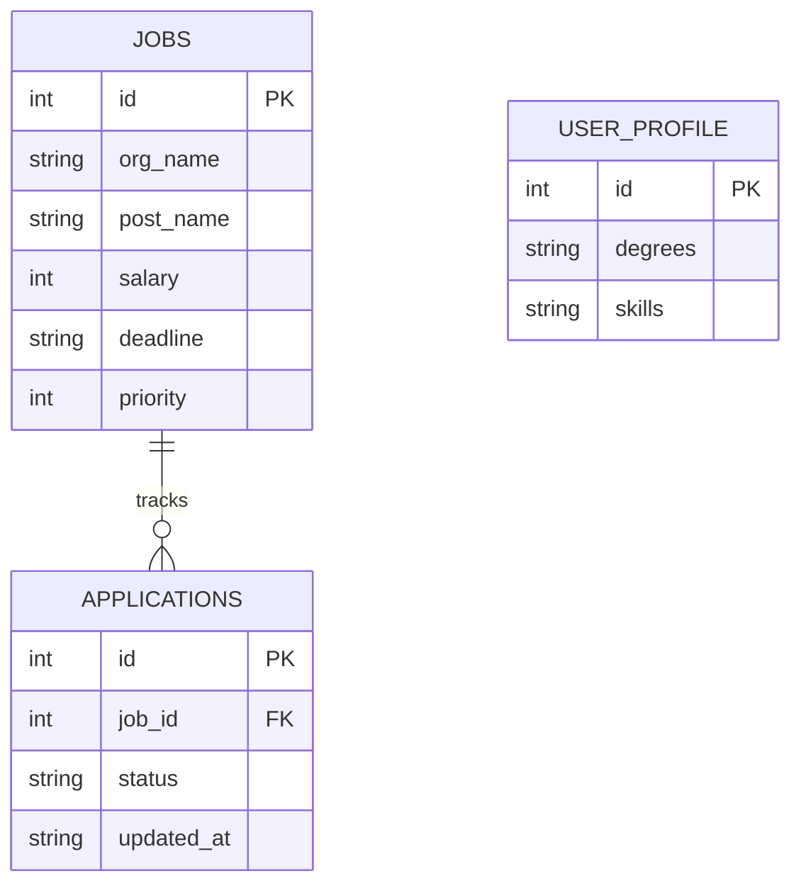

# Database ER Diagram

```mermaid
erDiagram
    JOBS {
        int id PK
        string org_name
        string post_name
        int salary
        string deadline
        int priority
    }
    USER_PROFILE {
        int id PK
        string degrees
        string skills
    }
    APPLICATIONS {
        int id PK
        int job_id FK
        string status
        string updated_at
    }
    JOBS ||--o{ APPLICATIONS : tracks
```
